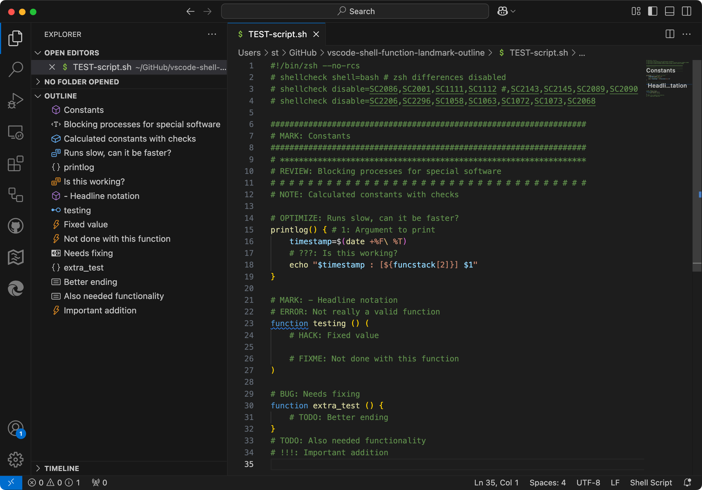

# Shell script functions and tags outline 1.0.0

## `shell-function-tag-outline`

Provide outline view for Shell script functions and tags.

### Functions

Whenever a function is defined in the script it will be placed in the outline.

### Comment tags

These special comments begin with a certain *tag* identifier. When one of the below *tags* are used they will appear in the outline with an icon:

- `# MARK:`
- `# NOTE:`
- `# REVIEW:`
- `# TODO:`
- `# FIXME:`
- `# HACK:`
- `# BUG:`
- `# OPTIMIZE:`
- `# !!!:`
- `# ???:`

**Based on shell-function-outline v1.2.2 by jannek@aalto 2021**
**Based on perl-outline v0.0.7 by hitode909.**
**They deserves much credit.**

## Future idea

Some editors handle this comment tag dash with a separator before the line:

- `# MARK: - Headline notation`

Could be interesting if that could be implemented.
